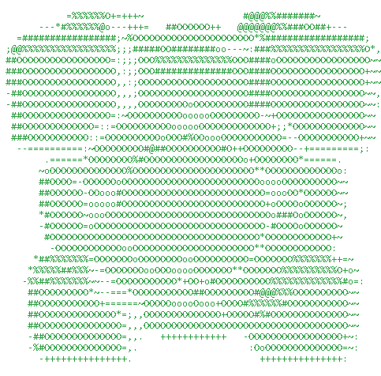
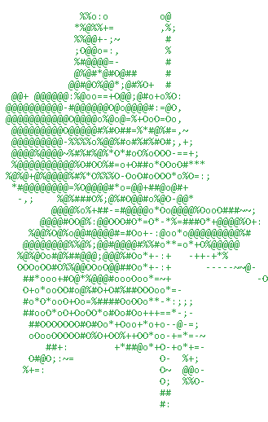

# 3D ASCII Rotator

A tiny native Windows x64 console application that renders shaded **3D solids
as animated ASCII art**. No runtime, no third-party libraries, just one small
native `.exe`.

<p align="center">
  
  
</p>

## Download

Prebuilt Windows x64 binaries are on the
[releases page](https://github.com/Grownz/3DASCIIRotator/releases/latest)
(latest asset: `ascii3D.exe`). No installer and no runtime are required.

## Features

- **Real 3D rendering.** Objects are described as signed distance fields and
  rendered by ray marching, so silhouettes and lighting are computed in three
  dimensions rather than faked in 2D.
- **High-quality shading.** Each character cell gets a surface normal and is
  lit with Blinn-Phong diffuse + specular highlights, a hemispheric ambient
  term, a fresnel rim light and distance-field ambient occlusion. Luminance is
  mapped onto a 15-level ASCII density ramp and every cell is supersampled 2x2
  for smooth edges.
- **Twelve shapes.** Cube, cylinder, diamond (octahedron), sphere, a
  stegosaurus, a Formula-style race car, a companion cube, "Die Maus", a trout,
  a kebab, the Brandenburg Gate and a "Tank Man" scene (the latter eight are
  embedded, ray-traced triangle meshes — see *Third-party assets*).
- **Cycle at runtime.** The shapes are kept in a list in insertion order;
  press `SPACE` to switch to the next one without restarting.
- **Bring your own models.** Drop `.stl`, `.obj` or `.ply` files into a
  `models/` folder next to the executable; they are detected automatically
  (live) and added to the `SPACE` cycle. Meshes with too many triangles are
  reduced with a shape-preserving LOD instead of being rejected. An optional
  `<name>.json` sidecar can set the up axis, rotation, zoom and display name.
- **Model list.** Press `Tab` for a scrollable list of every available
  shape/model on the right; pick with the arrow keys or the mouse wheel and
  load with `SPACE`/`ENTER`.
- **Colours.** While the list is open, its bottom third shows two 256-colour
  sliders, each with an ASCII logo: one for the **mesh colour** (`Left` /
  `Right`) and one for the **light-source colour** (`Shift`+`Left` / `Right`).
  The characters are tinted from the mesh colour (shadow) to the light colour
  (lit). Black and the five darkest greys are skipped so the art stays readable;
  the choice applies immediately.
- **Always framed.** The model is auto-fitted to the view so its silhouette
  comes within about 5% of the terminal edge (at least one margin is always
  under 10%), and the scale is rotation-invariant, so it keeps the same size
  while it turns.
- **Animation export.** Press `g` (GIF) or `p` (animated PNG) to write one full
  360-degree turn with the current colours, tilt and spin speed to
  `ascii3D_<shape>.gif` / `.png` in the working directory. Transparent
  background, no HUD. The image is scaled so its longest side is at most
  **1280 px**, and the palette contains **only the colours actually used**
  (GIF via LZW; PNG as a palette image with a few alpha levels).
- **FPS readout.** Press `Pos1` / `Home` to toggle a frames-per-second display
  in the bottom-left corner.
- **Always spinning.** The solid rotates around the vertical (z) axis at
  15 deg/s by default.
- **Tiltable spin axis.** Press `Up` / `Down` to tip the spin axis away from or
  towards the viewer in 5 deg steps, up to 90 deg.
- **Live speed control.** Press `+` / `-` to change the spin in 5 deg/s steps
  between 5 and 90 deg/s while it runs.
- **Shatter physics.** Press `Enter` to break the solid apart: every character
  becomes a particle that falls under gravity and piles up on the invisible
  floor the object was resting on. Press `Enter` again to rebuild it.
- **Clean exit.** `ESC` restores your console exactly as it was.
- **Tiny and dependency-free.** Plain C99 compiled with MSVC straight to a
  native Windows x64 executable.
- **Fast.** Rendering is multi-threaded across all cores (via a lightweight
  blocking worker pool — no OpenMP runtime and no busy-waiting, so idle CPU use
  is minimal), the object/camera transform is hoisted out of the per-ray code,
  meshes use a cache-friendly BVH with a packed triangle layout, and analytic
  shapes use adaptive supersampling. The interactive loop is capped to a
  target frame rate (default `60`, `--fps`), and `--bench <frames>` reports
  `ms/frame` and `fps`.

## Requirements

- Windows 10 or newer (x64). Windows Terminal or the classic console both work
  (ANSI/VT escape sequences must be supported).
- The prebuilt binary is compiled for **AVX2** (Haswell 2013 or newer) and
  multi-threaded; rendering uses all available cores.
- To build: Visual Studio 2022 or the Visual Studio Build Tools with the
  "Desktop development with C++" workload (MSVC compiler + Windows SDK). No
  other runtime is required. Regenerating the embedded models additionally
  needs Python 3 with numpy and trimesh (and pygltflib for the stegosaurus).

## Build

From the project root, run:

```bat
build.bat
```

This locates your Visual Studio installation, initializes the MSVC
environment and produces `build\ascii3D.exe`.

## Usage

```bat
build\ascii3D.exe -s cube
```

### Options

| Option | Description |
| --- | --- |
| `-s`, `--shape <name>` | Shape to render: `cube`, `cylinder`, `diamond`, `sphere`, `stego`, `f1`, `companion`, `maus`, `fish`, `kebab`, `berlin`, `china`, or a model name from `models/` (default: `cube`). |
| `-h`, `--help` | Show help and exit. |
| `-v`, `--version` | Show the version and exit. |
| `--angle <deg>` | Initial rotation angle in degrees (default: `0`). |
| `--tilt <deg>` | Initial spin-axis tilt in degrees, `-90`..`90` (default: `0`). |
| `--snapshot` | Render a single frame as plain text to stdout and exit. |
| `--shatter` | With `--snapshot`: shatter the solid and simulate the fall. |
| `--sim <sec>` | With `--shatter`: how many seconds to simulate (default: `3`). |
| `--menu` | With `--snapshot`: also draw the model list (preview). |
| `--lod <level>` | With `--snapshot`: render at a given LOD level (`0`..`6`). |
| `--bench <frames>` | Benchmark offscreen rendering (`ms/frame`, `fps`) and exit. |
| `--fps <n>` | Interactive frame-rate cap (`1`..`240`, default `60`; `0` = uncapped). |
| `--export <fmt>` | Write a full 360-degree animation (`gif` or `png`) and exit. |

### Examples

```bat
build\ascii3D.exe -s sphere
build\ascii3D.exe --shape diamond
build\ascii3D.exe -s cylinder --angle 30
build\ascii3D.exe -s cube --tilt 45
build\ascii3D.exe -s stego
build\ascii3D.exe -s f1 --tilt 20
build\ascii3D.exe -s companion
build\ascii3D.exe -s maus
build\ascii3D.exe -s fish
build\ascii3D.exe -s kebab
build\ascii3D.exe -s berlin --tilt 15
build\ascii3D.exe -s china
build\ascii3D.exe --snapshot -s cube > frame.txt
build\ascii3D.exe --snapshot -s stego --angle 90
build\ascii3D.exe --snapshot -s f1 --shatter --sim 2 > settled.txt
```

## Controls

| Key | Action |
| --- | --- |
| `ESC` | Quit. |
| `+` | Increase spin speed by 5 deg/s (maximum 90 deg/s). |
| `-` | Decrease spin speed by 5 deg/s (minimum 5 deg/s). |
| `Up` / `Down` | Tilt the spin axis away from / towards the viewer in 5 deg steps (maximum 90 deg). Paused while the model list is open. |
| `Enter` | Shatter the solid; press again to rebuild it. |
| `Space` | Switch to the next shape; while the model list is open, load the selected model. |
| `Tab` | Toggle the model list on the right. While open, `Up`/`Down` or the mouse wheel move the selection, `Enter`/`Space` load it, and `Tab` closes it. |
| `Page Up` / `Page Down` | Weaker / stronger LOD for meshes that were reduced (too many triangles). |
| `Left` / `Right` | In the open model list: move the mesh-colour slider (applied live). |
| `Shift`+`Left` / `Right` | In the open model list: move the light-source colour slider. |
| `Pos1` / `Home` | Toggle the FPS display in the bottom-left corner. |
| `g` / `p` | Export a full 360-degree turn as an animated GIF / APNG (current colours, tilt and speed; transparent background, no HUD). |
| `R` | Rescan the `models/` folder now. |
| `q` | Quit (convenience alias for `ESC`). |

## Bring your own models

Drop 3D files into a **`models/`** folder next to `ascii3D.exe` (created on
first start). They are picked up automatically and appended after the built-in
shapes, in alphabetical order; `SPACE` cycles through them and `R` forces a
rescan. Press **`Tab`** for a scrollable list on the right that shows every
available shape and model by name (file names without extension); pick with the
arrow keys (or the mouse wheel) and load with `SPACE`/`ENTER`.

- **Formats:** STL (binary and ASCII), OBJ, PLY (ASCII and binary
  little-endian). Convert anything else (e.g. glTF) to one of these first.
- **Limits & LOD:** a file up to 128 MB and up to 5M triangles is read. A mesh
  with more than 500k triangles is **reduced with a shape-preserving LOD**
  (vertex-cluster decimation) instead of being rejected; `Page Up` / `Page Dn`
  cycle the LOD strength (about halving the triangle count each step). Very
  heavy meshes also drop the 2×2 supersampling to keep the frame rate up.
- **Orientation:** models are assumed **Z-up** and centred/scaled
  automatically. Anything else can be fixed with a sidecar.
- **Sidecar (optional):** a `<name>.json` next to the model:

  ```json
  {
    "up":    "z",
    "yaw":   0,
    "pitch": 0,
    "elev":  15,
    "zoom":  1.0,
    "name":  "My Model"
  }
  ```

  `up` is `z`, `y` or `x` (which model axis points up); `yaw`/`pitch` are extra
  degrees; `elev` is the camera elevation for this model; `zoom` multiplies the
  auto-fit scale; `name` overrides the display/CLI name.
- The `models/` folder is git-ignored (your files stay out of the repository).

## How it works

Each character cell maps to a ray cast into the scene. A signed distance
function (`sdf`) describes the selected solid; ray marching walks along the
ray until it hits the surface. The camera sits slightly above the horizon so
the top faces and caps of the solids are visible, which makes the 3D form easy
to read. The surface normal is obtained from the distance-field gradient, and
the point is shaded with:

1. a hemispheric **ambient** term (brighter from above),
2. **Blinn-Phong diffuse** light from the upper-left front,
3. a tight **specular** highlight,
4. a **fresnel rim** light along the silhouette,
5. distance-field **ambient occlusion** for contact shading.

The resulting luminance drives the 15-level ASCII ramp `" .,:;~-=+*oO#%@"`,
and each cell is sampled 2x2 to smooth the edges. The object is rotated about
the vertical `z` axis by integrating the current spin speed over real elapsed
time, so the motion speed is independent of the frame rate. The `Up` / `Down`
keys tilt that axis about the horizontal `x` axis.

All other shapes are **triangle meshes** ray-traced with a bounding-volume
hierarchy and shaded flat: the built-in models and any user-supplied models
from `models/`. Each is centred and automatically scaled to fill the current
view (accounting for perspective) with a camera elevation that suits it; very
heavy meshes switch off the 2×2 supersampling to stay interactive.

When you press `Enter`, the current characters are turned into particles with a
small random outward kick. Each particle is integrated with gravity and air
friction, bounces with restitution off the ground and its neighbours, and then
settles into a shallow debris layer on the floor the object was resting on.

## Project layout

```
3DASCIIRotator/
  src/main.c            application source (shapes, rendering, registry)
  src/loader.c          STL / OBJ / PLY readers
  src/loader.h          loader interface
  src/simplify.c        vertex-cluster LOD decimation
  src/simplify.h        simplify interface
  src/export.c          animated GIF / APNG writers
  src/export.h          export interface
  src/stego_model.h     embedded stegosaurus mesh (generated)
  src/f1_model.h        embedded F1 car mesh (generated)
  src/companion_model.h embedded companion cube mesh (generated)
  src/maus_model.h      embedded "Die Maus" mesh (generated)
  src/fish_model.h      embedded trout mesh (generated)
  src/kebab_model.h     embedded kebab mesh (generated)
  src/berlin_model.h    embedded Brandenburg Gate mesh (generated)
  src/china_model.h     embedded "Tank Man" scene mesh (generated)
  docs/companion.gif    preview animation (generated)
  docs/moses.gif        preview animation (generated)
  docs/models-feature.md  design notes for user models
  tools/make_stego_model.py    regenerates src/stego_model.h
  tools/make_shape_models.py   regenerates the other model headers
  tools/make_preview_gif.py    regenerates the preview GIFs (docs/*.gif)
  build.bat             MSVC build script
  readme.md             this file
  changelog.md          version history
```

A `models/` folder is created next to the built `ascii3D.exe` on first start;
it is where user models go and is git-ignored.

The generated headers are committed, so a normal build only needs MSVC. To
regenerate them (needs Python 3 with numpy and trimesh; the stegosaurus
additionally needs pygltflib; the source models are downloaded on demand):

```bat
python tools\make_stego_model.py
python tools\make_shape_models.py
```

## Third-party assets

- **Stegosaurus** — model by **[Quaternius](https://quaternius.com)**, licensed
  [CC0 1.0](https://creativecommons.org/publicdomain/zero/1.0/), via
  [poly.pizza](https://poly.pizza/m/eFcNbOlpvl). Skinned, re-oriented and
  scaled by `tools/make_stego_model.py`.
- **F1 car** — the "race" car from **[Kenney](https://kenney.nl/assets/car-kit)**'s
  Car Kit, licensed
  [CC0 1.0](https://creativecommons.org/publicdomain/zero/1.0/). A generic
  open-wheel Formula-style car; it is not a replica of any specific 2008 team.
- **Companion cube** — "Portal: Companion Cube" by *Prateek Karajgikar* via
  [poly.pizza](https://poly.pizza/m/ccQRPuBwXrU), licensed
  [CC BY 3.0](https://creativecommons.org/licenses/by/3.0/) (attribution
  required). *Portal* and the Companion Cube are trademarks of Valve; this is
  fan-made geometry.
- **"Die Maus"** — no permissively-licensed model was available, so this one is
  original geometry built from primitives by `tools/make_shape_models.py`. It is
  an homage to the WDR character and is not an official model.
- **Trout** — "Trout" by **Poly by Google** via
  [poly.pizza](https://poly.pizza/m/2W2sKWYvk8k), licensed
  [CC BY 3.0](https://creativecommons.org/licenses/by/3.0/) (attribution
  required).
- **Kebab** — "Kebab" by **Poly by Google** via
  [poly.pizza](https://poly.pizza/m/47UYz6vLa_V), licensed
  [CC BY 3.0](https://creativecommons.org/licenses/by/3.0/) (attribution
  required). It is a skewer kebab; no free *Döner* sandwich model was available.
- **Brandenburg Gate** — original geometry built from primitives by
  `tools/make_shape_models.py` (colonnade, entablature and quadriga); no
  permissively-licensed model was available.
- **"Tank Man" (`china`)** — the figure is from the **"Tiananmen Square
  Playset"** by *WindhamGraves* ([Thingiverse thing 6007266](https://www.thingiverse.com/thing:6007266));
  the Type 59 tank is original geometry. Both are baked by
  `tools/make_shape_models.py`.

The built-in meshes are baked into the C headers listed above; user models are
loaded at runtime from the `models/` folder.

## Versioning

Current version: **0.2.12**. See [changelog.md](changelog.md) for details.

## Roadmap

- Later: more formats, model thumbnails, per-model sidecar presets.

## License

Released under the **MIT License**. See [LICENSE](LICENSE) for the full text.

Copyright (c) 2026 Grownz.
